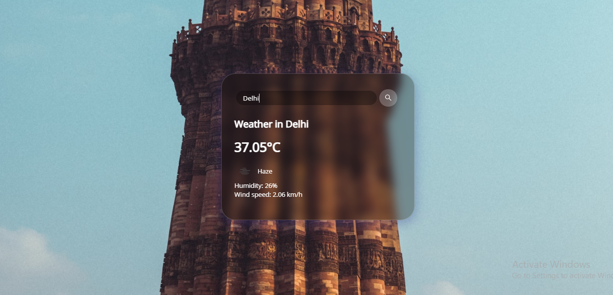
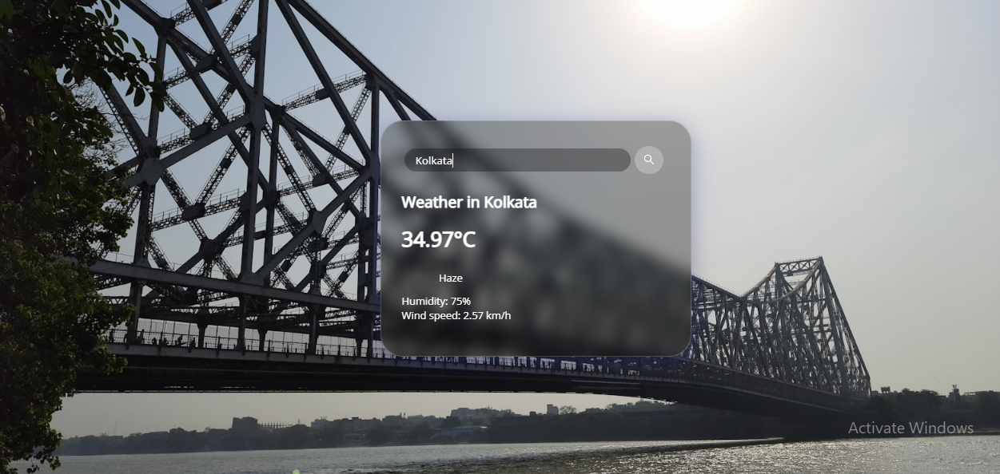

# Weather-Web-App

A simple, web-based weather application that provides real-time weather information for any location around the globe. The app fetches weather data from a reliable weather API and displays it in a user-friendly interface.

## Features

- **Real-time Weather Data:** Get up-to-date weather information including temperature, humidity, wind speed, and more.
- **Location Search:** Search for weather information by city name or geographic coordinates.
- **Responsive Design:** Optimized for desktop and mobile devices.

## Installation

To get a local copy up and running, follow these simple steps.

### Prerequisites

- A weather API key from a service like OpenWeatherMap.

### Installation Steps

1. Clone the repository:

   ```bash
   git clone https://github.com/your-username/weather-app.git






